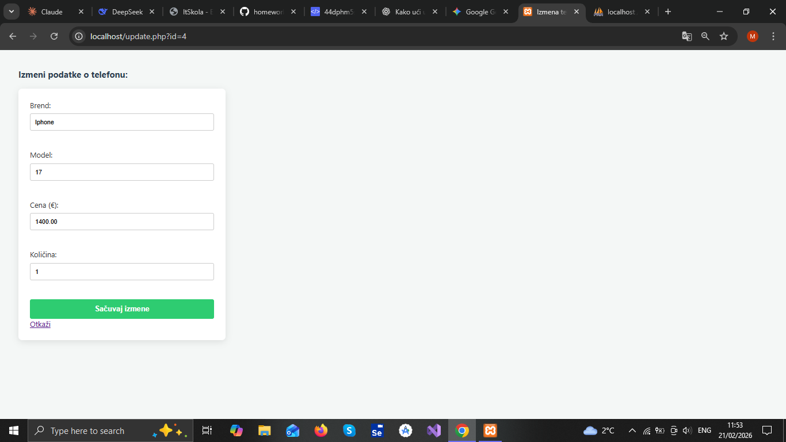
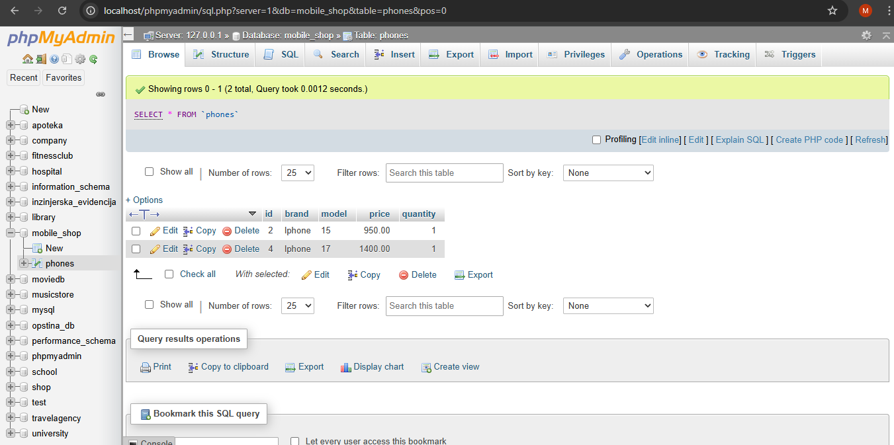

📱 Mobile Shop - Menadžment Lagera

Ovo je web aplikacija za upravljanje lagerom mobilnih telefona, razvijena kao **CRUD** sistem (Create, Read, Update, Delete). Projekat koristi PHP za serversku logiku i MySQL za skladištenje podataka, uz moderan dizajn postignut kroz eksterni CSS.

📸 Pregled Projekta (Screenshots)

Ispod se nalaze vizuelni prikazi glavnih delova aplikacije, uključujući kod i bazu podataka:

1. Glavna stranica (index.php)

Prikaz centralne tabele sa lagerom i formom za unos novih modela.

2. Izmena podataka (update.php)

Interfejs koji omogućava brzo ažuriranje informacija o telefonima.

3. Baza podataka (phpMyAdmin)

Pregled `mobile_shop` baze i strukture tabele `phones`.

🛠️ Funkcionalnosti

* **Pregled**: Dinamički prikaz svih uređaja iz baze.
* **Dodavanje**: Unos novih artikala putem validirane forme.
* **Izmena**: Ažuriranje cene, količine i naziva postojećih modela.
* **Brisanje**: Uklanjanje artikala sa lagera jednim klikom.

📂 Tehnologije

* **Backend**: PHP (mysqli konekcija)
* **Baza podataka**: MySQL
* **Frontend**: HTML5, CSS3 (Segoe UI dizajn)
* **Alati**: XAMPP, phpMyAdmin

⚙️ Podešavanje baze

Da bi aplikacija radila, potrebno je izvršiti sledeći SQL upit u vašem SQL editoru:

CREATE TABLE phones (
    id INT(11) AUTO_INCREMENT PRIMARY KEY,
    brand VARCHAR(100) NOT NULL,
    model VARCHAR(100) NOT NULL,
    price DECIMAL(10,2) NOT NULL,
    quantity INT(11) NOT NULL
);

Podešavanje lokalnog servera

Instalirajte i pokrenite XAMPP.
Smestite ceo folder projekta u folder: C:\xampp\htdocs\.
U XAMPP Control Panel-u pokrenite module Apache i MySQL.

Pokretanje aplikacije

U vašem veb brauzeru otvorite adresu:
localhost/Mobile Shop/index.php